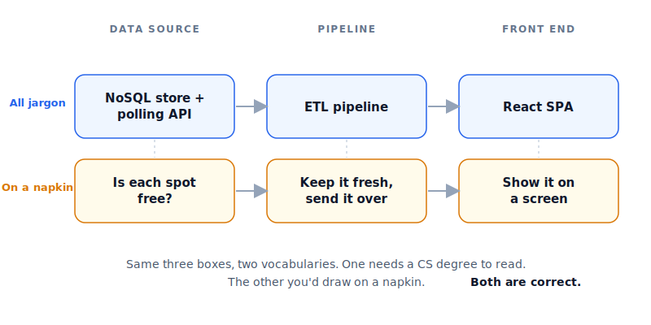
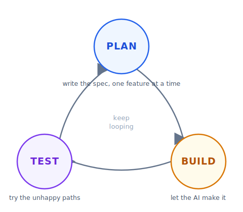
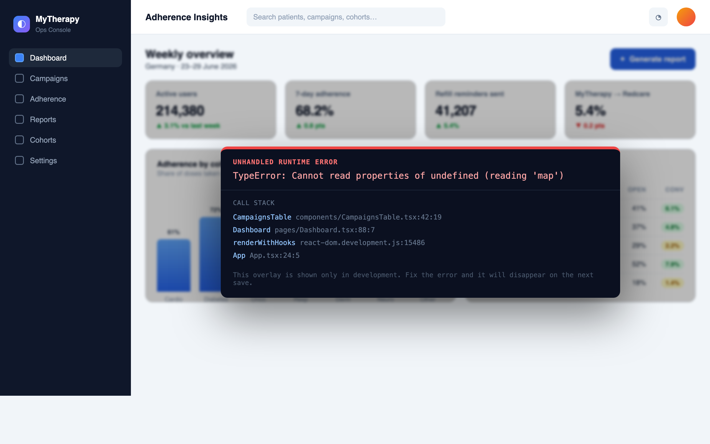
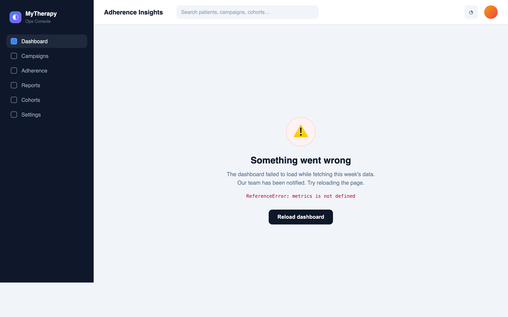
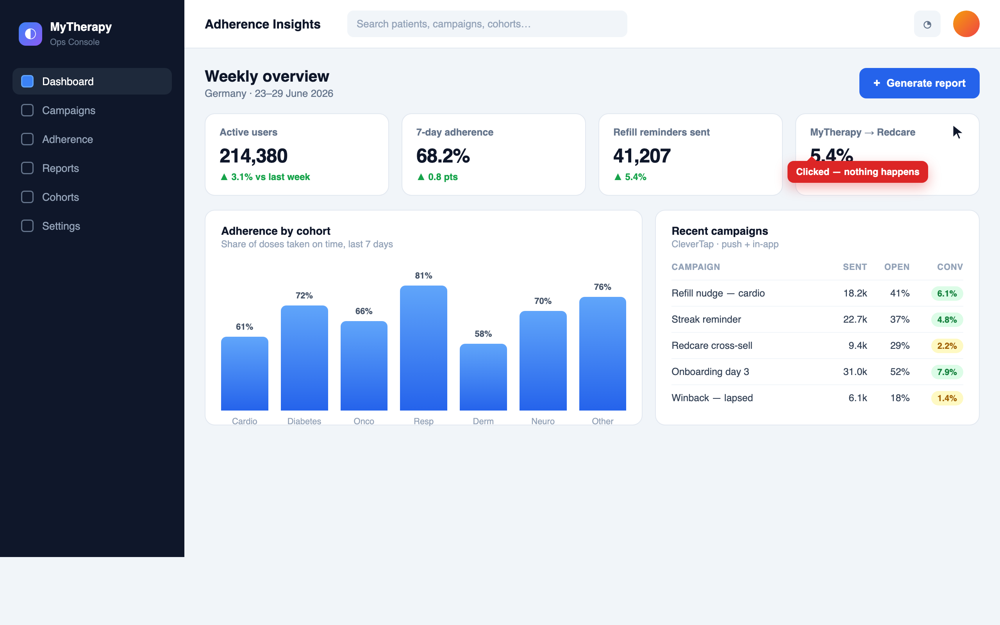
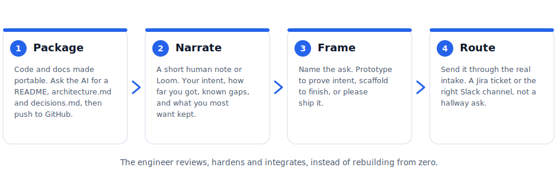

# Vibe Coding at smartpatient — your field guide

The take-home from our session on **3 July 2026**. Not the slides and not a recording — the durable version of what we practised, written so you can come back to it, reuse it, and hand it to a colleague who wasn't there.

Keep this as your home base. Two focused guides sit alongside it:

- **[Keeping Figma Make on your design system](./design-system-with-figma-make.md)**.
- **[Exercise bank](./exercise-bank.md)**: small projects related to real challenges at Smartpatient, to keep the momentum going.

---

## How to use this guide

You can read it end-to-end, then treat it as reference. The **[Copy-paste prompts](#copy-paste-prompts--templates)** and the **[safety notes](#safety--security-in-your-world)** are the bits you might come back to more than once.

- [The one idea](#the-one-idea)
- [The playbook](#the-playbook) — plan, architect, interview, iterate, debug, reset, hand off, set rules
- [Copy-paste prompts & templates](#copy-paste-prompts--templates)
- [Safety & security in your world](#safety--security-in-your-world)
- [Glossary](#glossary)
- [Going further](#going-further)
- [Spec-driven development (AWS/Kiro) notes](spec-driven-development.md)
- [Advanced Outlook Automation with Copilot](advanced-automation.md)
- [Work with us](#work-with-us)


---

## The one idea

If you remember one thing: **building with AI is a conversation. It's about knowing what you want, and knowing how to communicate well.**

- The skills that matter are **transferable**, not tool-specific. Every core vibe coding skill works in Figma Make, Cursor, Claude, or whatever comes next.
- You manage the AI the way a **good product manager manages a junior employee**, setting direction and judging output without doing every step yourself.

### Plan before you prompt

The number-one first-timer mistake is dropping one vague prompt and expecting a perfect build. You can picture exactly what you want, but you haven't written it down. Therefore, AI fills the gaps itself with invented features, data, and steps.

The solution is **spec-driven development**, roughly *"95% planning, 5% building."* Separate the stable **what** (your intent) from the flexible **how** (the code).

> *"Prompt-first workflows can work well for simple tasks, but they often struggle as scope and complexity increase. Instead of asking AI to infer intent from scattered prompts, teams define intent explicitly and use AI to execute against it."* — Apoorv Gupta, Microsoft

Start every build from the **brief template** in [Copy-paste prompts](#copy-paste-prompts--templates).

### You're the architect, not the coder

Systems design is the core vibe-coding skill. Being an architect is **not** the same as knowing the tech stack, and it does not need deep technical knowledge.

Imagine you want to build a parking-spot app that shows whether city-centre spots are free or not. You could diagram the system in various ways, for example:

- **Version 1 (all jargon):** `NoSQL store + polling API` → `ETL pipeline` → `React SPA`
- **Version 2 (simple, intuitive):** `Is each spot free?` → `Keep it fresh, send it over` → `Show it on a screen`

Same three boxes. One needs a CS degree to read, the other you'd draw on a napkin. **Both are correct.** You need to know if the spots are open (a data source), get that to the user (a pipeline), and show it (the front end).

<p align="center"></p>

**Pro Tip:** Always ask "what data does this need?" Almost every app has at least one data source.

### Build in small steps

Even a well-described app won't come out perfect first time. That's normal, not failure. Accepting the first output straight from the box is almost never right.

So: **"add one feature," not "build me this app."** Small steps keep you in control. Work the loop: **Plan → Build → Test → back around.**

<p align="center"></p>

**Pro tip:** ask the AI to decompose your larger plan into steps, so it chooses the sequence. Some tools do this natively (Claude Code, "Plan" mode in Cursor).

### Prototype vs production

Most of what you get from Figma Make after a few prompts is not an actual working app, even though it looks like one. It appears to work, but is often just running on fake, mocked data. It's very easy to think it's done when it's really a mockup.

The test: **ask the AI where the data comes from.**

> Where is this data coming from, is it real, or mocked? If mocked, what would it take to make it real?

A gorgeous dashboard on invented numbers is not a working app. Making the data real (a real back end, through a real API, with keys kept safe) is very doable, and it's the difference between a demo and a tool.

### When it breaks: Dealing with bugs and errors

Vibe coding famously produces lots of errors. But have no fear, you can easily debug them with AI!

Here are examples of common ways you might encounter an error:

**1. An error message** — the tool caught it and showed you the text, in the preview or the terminal.

<p align="center"></p>

**2. A blank or broken screen** — it opens to nothing, or shows a friendly "Something went wrong."

<p align="center"></p>

**3. A button that does nothing** — the screen looks fine, but the action silently fails.

<p align="center"></p>


| What you see                                                | What it is                      | Your move                                                        |
| ----------------------------------------------------------- | ------------------------------- | ---------------------------------------------------------------- |
| An error message (the AI shows it, or it's in the terminal) | The tool caught it              | Paste the exact text straight back in                            |
| A blank / broken screen, or "Something went wrong"          | A visual / UI error             | Screenshot it, say what you did just before                      |
| A button that does nothing                                  | An invisible / functional error | Describe what *should* happen vs what does; screenshot if useful |


**Catalogue, then batch.** Instead of fixing one bug at a time (which clutters the conversation, aka "polluting the context"), collect several and drop them in together, like a round of QA. Modern tools handle a batch better than a drip.

**Pro tips:** ask *"what do you think went wrong? List a few possibilities if you're not sure."* And if you already suspect the cause or know the fix, say so up front instead of waiting.

### Context & resets

AI has a working memory that fills up, known as its "context window". Give it the right information, meaning **never too much** (it gets confused, which is called *context rot*) and **never too little** (it starts guessing).

**Reset signals** — start a fresh chat when: debugging goes in circles, prompts stop landing, you can only tweak the edges of a structure you don't actually want (a wrong assumption is baked in), or the chat is just long and messy. Don't fight a confused AI.

**Before you reset, document important things you don't want to lose.** Have it write a short document or two with notes on what happened, the decisions and why, and what's next. Save as `.md` (models love Markdown) and point the files at each other. Then open a clean chat on the same project with that plan. This habit is part of the practice of **context engineering**, and it's the highest-leverage thing an advanced user does.

### Set your rules once

Instead of re-explaining yourself every build, write your standing rules down **once**. The AI stays consistent, stops re-introducing what you keep deleting, and the rules travel to whoever picks the project up next.

Every serious tool has a standing-rules file, one mechanism under different names:


| Tool                  | File                                                |
| --------------------- | --------------------------------------------------- |
| Figma Make            | `Guidelines.md` (open Code → the guidelines folder) |
| Claude / Claude Code  | `CLAUDE.md`                                         |
| Cross-tool convention | `AGENTS.md`                                         |
| Cursor                | Cursor rules                                        |


Three things worth putting in it:

1. **Your design system** — tokens, fonts, components, what should never be hardcoded. (This gets genuinely fiddly for a real system — see the [design-system guide](./design-system-with-figma-make.md).)
2. **Who you are / your voice** — a small `about-[name]` file so its output sounds like you, not generic AI.
3. **Your domain security rules** — see the smartpatient rules in [Safety](#safety--security-in-your-world).

There's a ready `AGENTS.md` starter in [Copy-paste prompts](#copy-paste-prompts--templates).

---

## Handoffs from Vibe Coder to Engineer

Figma Make races to about **80%**, then stalls. Pushing to 100% means robustness and safety, not just a happy demo under ideal circumstances.

**You don't always need 100%.** Name the path early:

- **Exploration / internal / personal?** Good enough is fine.
- **Customer-facing, sensitive data, or complex?** It might need to be more rock solid.

When you hand work to an engineer, don't make them restart from zero. Use the following framework to ensure a smooth handover:

- **Package** — get the code and docs into a portable state. Have the AI write a `README`, `architecture.md`, and `decisions.md`, and push to GitHub.
- **Narrate** — add what the docs can't: a short human note (or Loom) on your intent, how far you got, known gaps, and the one or two things you most want kept.
- **Frame** — say which ask it is: *"prototype to prove intent," "scaffold to finish,"* or *"please ship it."*
- **Route** — send it through the proper intake (a Jira ticket, the right Slack channel), not a hallway message.

<p align="center"></p>

**The handoff-ready test:** an engineer can answer *"what is this, why, and what's left?"* in five minutes without you in the room.

**For engineers:** over time, as the company gets more confident with vibe coding, expect more apps coming your way from non-technical builders, including from leaders! (think: CEO, Sr. Product Managers, even investors). Assign someone to own the reviews and hardening, with a triage process for what's priority. Equally important, decide which apps don't need an engineer at all, sending those back with clear next steps.

---

## Copy-paste prompts & templates

**The brief template** — start every build here:

```
Build a [type of app] that helps [who] do [what].
It should let them [2–3 key actions].
Keep it simple.
```

**Have the AI interview you** — paste after a brain-dump:

```
Here's an unstructured brain-dump of an app idea [+ a photo of my sketch].
Before you write any plan, ask me a few questions to understand what I actually
want. Keep summarising the plan back to me as we go. When it's solid, write it up
as a single planning document I can review.
```

**Decompose into steps** — after you have a plan:

```
Break this plan into small, ordered build steps. Do the first one only, then stop
and show me before continuing.
```

**Make it handoff-ready** — before you give work to an engineer:

```
Write a README, an architecture.md, and a decisions.md for a new engineer picking
this up cold. Assume they can't ask me questions. Then push it all to a private
GitHub repo.
```

**Security self-audit** — run in a *fresh* session:

```
Review this app for security problems — exposed API keys or secrets, anything that
leaks personal or sensitive data, missing access controls, and error messages that
spill internal detail. List what you find and fix the critical issues.
```

**`AGENTS.md` starter** — let it interview you:

```
Make me an AGENTS.md for this project. Ask me 5 questions right now to decide what
goes in it — my design rules, my voice, and my security non-negotiables.
```

(For a Figma Make `Guidelines.md` starter, see the [design-system guide](./design-system-with-figma-make.md#step-4--a-light-touch-guidelinesmd).)

---

## Safety & security in your world

smartpatient's instinct is already the right one: be reasonable and balanced — safe, but not so locked-down that no progress is possible. This section keeps you there.

Three things commonly leak for vibe coders:

- **Keys.** An API key left in your code is the house key under the mat — anyone who sees the code can run up your bill. Keep keys out of code, in the tool's secrets store or environment variables.
- **Code.** A public repo exposes everything inside it — secrets, data, IP. Keep repos **private**; know where your code lives.
- **Data.** Don't store what you don't need. Even internal apps can leak user data quietly through logs.

**Turn training off once, for the whole team.** In Figma: **Settings → AI → Manage AI settings → toggle Content training off** (already off by default on Org / Enterprise plans).

**Let a fresh AI audit its own code.** The same AI that writes bugs is brilliant at finding them in a separate session — use the self-audit prompt above.

---

## Glossary

Shared vocabulary is what lets a designer, a developer, and a PM describe the same workflow without three different words for it.

### AI & vibe-coding terms


| Term                | What it means                                                                                                                                                                                               |
| ------------------- | ----------------------------------------------------------------------------------------------------------------------------------------------------------------------------------------------------------- |
| **Automation**      | Fixed steps. Same input, same output, no thinking. A Zapier flow sending every form response into a Sheet.                                                                                                  |
| **Agent**           | AI with a goal that chooses its own steps and adapts mid-task, rather than just answering. Tell Claude Code "build a login page" and it checks the folders, writes the code, runs the tests, fixes the bug. |
| **Context**         | Everything the AI can "see" in a conversation — chat history, uploaded files, anything fed into the prompt.                                                                                                 |
| **Chat history**    | The record of earlier messages. Correct a chatbot's tone in message 3 and it holds it in message 10.                                                                                                        |
| **Content filters** | Safety layers that block or flag certain inputs and outputs.                                                                                                                                                |
| **Hallucination**   | When AI produces something confident-sounding but factually wrong (e.g. citing a legal case that doesn't exist).                                                                                            |
| **LLM memory**      | What a model keeps between sessions. By default, nothing — anything that carries over is a feature layered on top.                                                                                          |
| **RAG**             | AI that pulls from a specific knowledge base before answering, instead of relying only on training. A support bot that answers only from real product docs.                                                 |
| **Skill**           | A packaged workflow you hand an agent so it can reuse that capability on demand.                                                                                                                            |
| **Tokens**          | The units of text a model reads and writes. Length limits, memory, and cost are all measured in tokens, not words.                                                                                          |
| **API**             | Any way two pieces of software exchange data. Every app you use has one.                                                                                                                                    |
| **MCP**             | A standard plug (a "USB-C for AI") that lets an assistant reach many tools and data sources without hand-wired integration for each.                                                                        |


### Basic engineering terms for non-technical builders


| Term                                           | What it means                                                                                         |
| ---------------------------------------------- | ----------------------------------------------------------------------------------------------------- |
| **Front end / back end**                       | What you see and click, versus the stuff behind it that makes it work (data, logic, outside sources). |
| **Component**                                  | A reusable building block of an interface (a button, a card).                                         |
| **State**                                      | What the app currently "remembers" while you use it (which tab is open, what you typed).              |
| **Endpoint**                                   | A specific address on an API you call to get or send one kind of data.                                |
| **Environment variable**                       | A setting (often a secret, like a key) kept outside the code.                                         |
| **Edge case**                                  | An unusual input or situation the happy path didn't consider (empty, huge, or weird data).            |
| **Bug**                                        | Behaviour that isn't what you intended.                                                               |
| **Repository (repo)**                          | The folder where a project's code lives, tracked over time. **GitHub** hosts repos.                   |
| **Branch / commit / pull request**             | A saved slice of work, a snapshot, and a request to merge changes in.                                 |
| **Framework / library / package / dependency** | Pre-built code you build on top of, so you don't start from scratch.                                  |
| **Database / schema / query**                  | Where structured data lives, its shape, and how you ask it for something.                             |
| **CSV / JSON**                                 | Two common plain-text formats for data (spreadsheet-like, and nested).                                |
| **API key**                                    | A credential that proves you're allowed to use a service. Treat like a password.                      |
| **Server / hosting / deployment**              | The machine your app runs on, where it lives, and the act of putting it there.                        |
| **Staging vs production**                      | The safe rehearsal copy vs the real one your users touch.                                             |
| **Rollback**                                   | Undoing a deployment back to the last good version.                                                   |
| **Logs**                                       | The running diary an app writes about what it's doing — where you look when something breaks.         |
| **Rules file**                                 | A standing-instructions file (`AGENTS.md`, `CLAUDE.md`, Figma Make `Guidelines.md`).                  |


---

## Going further

**Curated links**

- **Prompting vocabulary** — [articulate design intent](https://index.how/to/articulate) · [animation vocabulary](https://animations.dev/vocabulary) · [describing websites](https://lafys.com/)
- **Claude Code, for non-engineers** — [for designers](https://yummy-design-sprint.notion.site/Getting-started-with-Claude-Code-3226279147098075b492fa5b93bdc191) · [for researchers](https://paulgp.substack.com/p/getting-started-with-claude-code)
- **Terminal basics** — [zero2claude.dev](https://zero2claude.dev/)
- **Design systems in Figma Make** — our [dedicated guide](./design-system-with-figma-make.md)

**Two quirks worth knowing**

- **AI loves Markdown.** Plain, structured text (headings, bullets, `.md` files) is what models read and write best. When in doubt, give it Markdown.
- **AI is strongest in TypeScript.** Some leading developers deliberately tell the AI to build in TypeScript even if they don't know it themselves, because future agents will handle that codebase especially well.

**Token-efficient formats (for the curious)** — when you're feeding lots of structured data to an AI, compact formats waste fewer tokens (and less energy and electricity and water) than JSON: **TOON** (Token-Oriented Object Notation), **TRON**, **ISON**, **MOL**. Same data, fewer tokens. Nice-to-know, not day-one.

---

## Work with us

We are Sofiia and Dan, the founders of Vibe Coding Collective. We ran your session, and we run many others like it. If our trainings or materials lit something up for your team, here is how we can go further together.

Aside from custom and bespoke workshops, we also do three kinds of preset private sessions:

- **For leaders.** AI org design, management strategy, and how to build an AI-first culture that actually sticks. This is for the people deciding how a whole company adopts AI, not just which tool to buy.
- **For product teams.** Engineers, designers, and PO/PMs in one room, learning how to weave AI through every part of how they work, with vibe coding at the centre. This is the natural next step after today for a single team that wants to go deep.
- **For engineers.** Advanced agentic coding for people who already ship. How to drive coding agents well, so one strong engineer can do the work of a small team.

Every session is hands-on and tuned to your world, the same way today was. Everyone builds something real. Nobody leaves with just notes.

Our recent work includes a library-staff training at TU Delft, a vibe-coding course for the Academy of Digital Industries, and an upcoming design-focused vibe coding training for IKEA.

Want to talk about a session for your team? Email Dan at [dan.porder@vibecoders.global](mailto:dan.porder@vibecoders.global), or find us both on LinkedIn. We would love to keep building with you.
